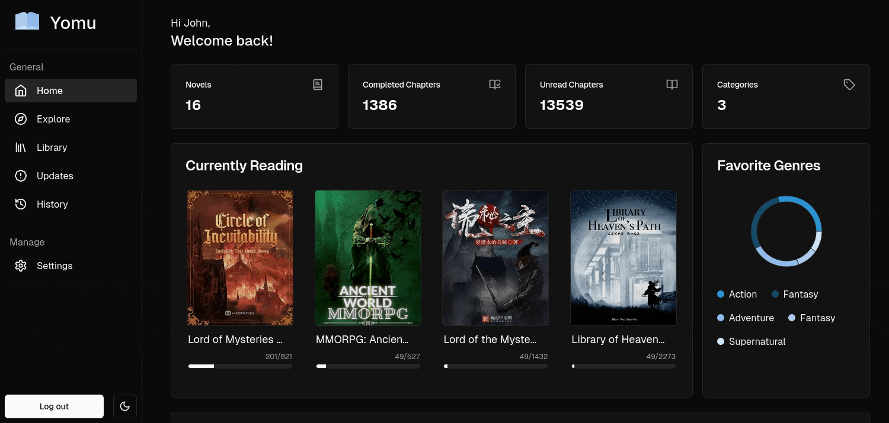

<div align="center">
<h1>Yomu</h1>
<h3>Next.js web client for Yomu</h3>
</div>
<div align="center">
    <a href="https://github.com/AGN907/Yomu/releases/latest">
      
    </a>
    <a href="https://hub.docker.com/r/agn907/yomu">
    
    </a>
    <a href="https://github.com/AGN907/yomu/issues?q=is%3Aopen+is%3Aissue+label%3Aweb">

</a>
    </div>

---

<div align="center">

</div>

## Features

- Browse the latest and trending novels from different third-party sources
- Search for your favorite novels
- Keep track of your novels
- Update novels for new chapters on the fly
- Search through your history of chapters
- Manage your novels with multiple categories

## Getting Started

As the web client is self-hosted you will need to make sure you have `Docker/Docker Desktop` installed to run it.

To install docker and docker desktop follow the instructions [here](https://docs.docker.com/desktop/install/)

You also need [Node.js](https://nodejs.org/en/) and [pnpm](https://pnpm.io/) installed.

Clone the repository and install the dependencies.

```shell
git clone https://github.com/AGN907/yomu.git
cd yomu
pnpm install
```

Rename the `.env.example` file to `.env.local` and you can modify the values or keep the default.

```shell
cd apps/web
mv .env.example .env.local
```

> [!TIP]
> Don't forget to return to the root of the folder using `cd ../..`

Finally you can run the web client:

```shell
// You can add `-d` to run it in the background
pnpm nx run web:run-container
```

Now visit the url shown in your terminal to see the web client.

> [!NOTE]
> You will need to create an account the first time you run the web client.

## Building

To build the docker image with the latest changes you will need to have these tools installed:

- Node
- pnpm
- Docker

Clone the repository and install the dependencies.

```shell
git clone https://github.com/AGN907/yomu.git
cd yomu
pnpm install
```

It will take a while to install the dependencies.

After the dependencies are installed you must rename the `.env.example` file to `.env.local`.

```shell
cd apps/web
mv .env.example .env.local
```

Now you can start building the image

```shell
cd ../.. # go back to root
pnpm nx run web:build-image
```

This command will name the image as `agn907/yomu:latest`. If you want a different name you can modify the script on the [package.json](./package.json)

Run `pnpm nx run web:run-container` to start the web client.

## Contributing

If you want to contribute to the project you can follow the [contributing guide](./CONTRIBUTING.md)
